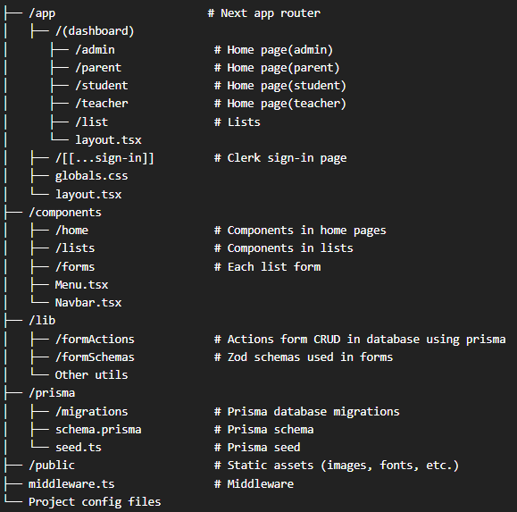

# Developer Guide: School Manager

In this documentation, we will explore a web application developed with Next.js, a powerful React framework, combined with Tailwind CSS for styling, Prisma as an ORM for database management, and Clerk for user authentication. The purpose of this project is to learn and practice modern web development techniques. It focuses on building a responsive web application to explore concepts such as frontend design and backend functionality.

## Table of Contents

1. [Technologies Used](#technologies-used)
2. [How to setup as development](#setup-as-development)
3. [Folder and File Structure](#folder-and-file-structure)
4. [Bugs and to do](#bugs-and-to-do)

## Technologies Used

- **[Next.js](https://nextjs.org/):** A React framework for building fast, server-side rendered web applications.  
- **[Tailwind CSS](https://tailwindcss.com/):** A utility-first CSS framework for designing responsive and modern interfaces.  
- **[Prisma with PostgreSQL](https://www.prisma.io/):** A next-generation ORM (Object-Relational Mapping) tool for database management.  
- **[Clerk](https://clerk.dev/):** A user management and authentication platform.

## Setup as development

OBS: An admin user will be created automatically after run the prisma seed, with the username "admin" and the password "admin".

### Prerequisites

Before you begin, ensure that you have the following installed:

- Node.js
- NPM

### Installation

**1. Install the dependencies:** 

Running the following command in your terminal:

```bash
npm install
```

**2. Set Environment Variables:**

Create a '.env' file in the root directory and configure the following variables:

```bash
DATABASE_URL=<Your database URL>
DIRECT_URL=<Your database direct URL>

NEXT_PUBLIC_CLERK_PUBLISHABLE_KEY=<Your Clerk publishable key>
CLERK_SECRET_KEY=<Your Clerk secret key>
NEXT_PUBLIC_CLERK_SIGN_IN_URL=/

NEXT_PUBLIC_CLOUDINARY_CLOUD_NAME=<Your Cloudinary cloud name>
NEXT_PUBLIC_CLOUDINARY_API_KEY=<Your Cloudinary API key>
CLOUDINARY_API_SECRET=<Your Cloudinary API secret>
```

Personaly, i'm using Supabase for the database, but you can use any database of your choice.

[Supabase](https://supabase.com/dashboard/projects)

[Clerk](https://dashboard.clerk.com/)

[Cloudinary](https://cloudinary.com/documentation/how_to_integrate_cloudinary)

**3. Configure Clerk:**

Go to your application in Clerk and navigate to 'configure'

* In 'Email, phone, username:

Mark as selected 'Username' in 'Username' field;

Mark as selected 'Password' in 'Authentication strategies' field;

Mark as selected 'Name' in 'Personal information' field;

* In 'Sessions':

Click in edit 'Customize session token', and add the following code:

```bash
{
	"metadata": "{{user.public_metadata}}"
}
```

**4. Initialize Prisma:**

Apply schema to your database:

```bash
npx prisma migrate deploy
```

Apply seed data to your database:

```bash
npx prisma db seed
```

**5. Run the development server:**

```bash
npm run dev
```

## Folder and File Structure

The following is the typical folder and file structure for the project:



## Bugs and to do

**Bugs**

- Empty screen on logout

**To do**

- Home
    - Admin
        - Make use of finance chart element
    - Parent, student, teacher
        - Show more data in calendar(BigCalendarContainer) - showing only exams.
        - Add event calendar(EventCalendarContainer) ?

- Users single page
    - Student, teacher
        - Make use of performance element
        - Show more data in calendar(BigCalendarContainer) - showing only exams.

- Error treatment for unique fields in database
